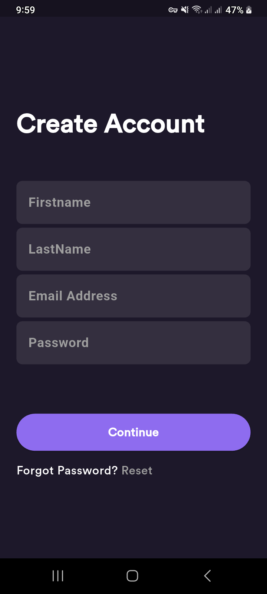
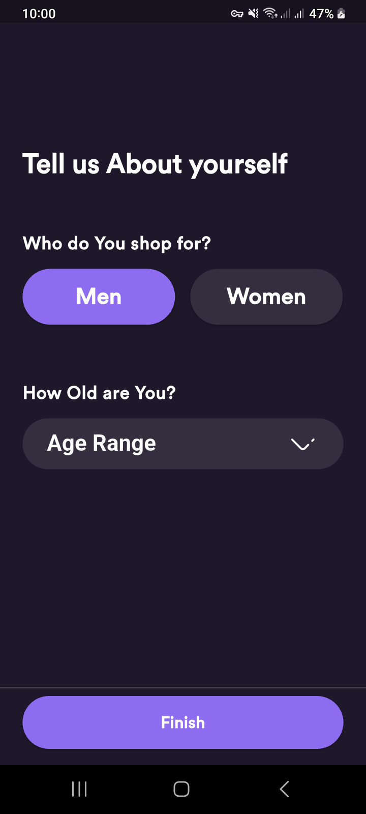
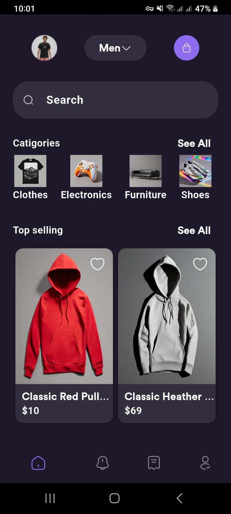
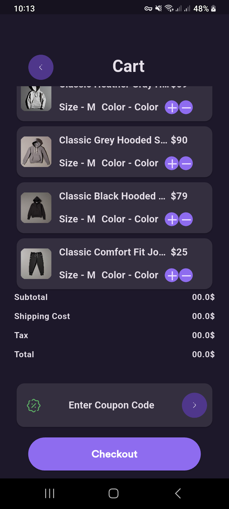
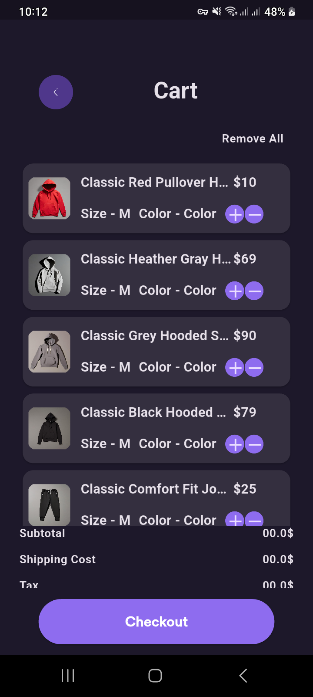
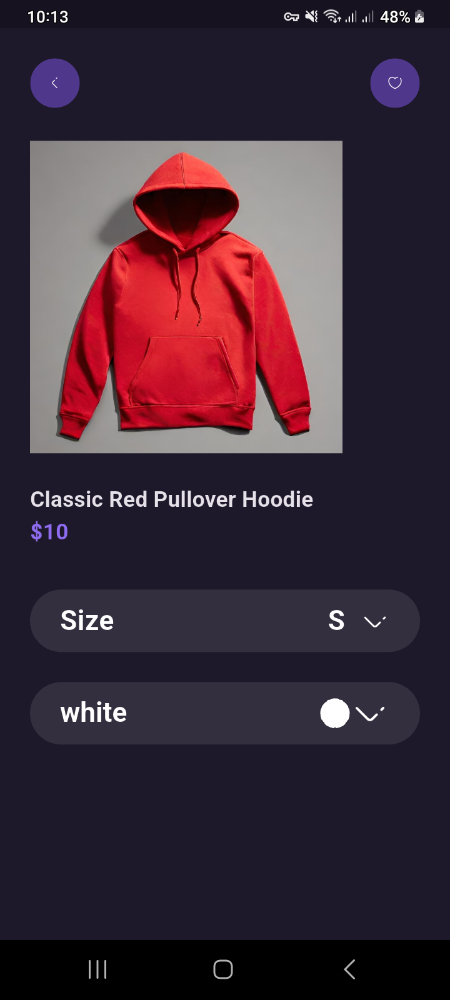
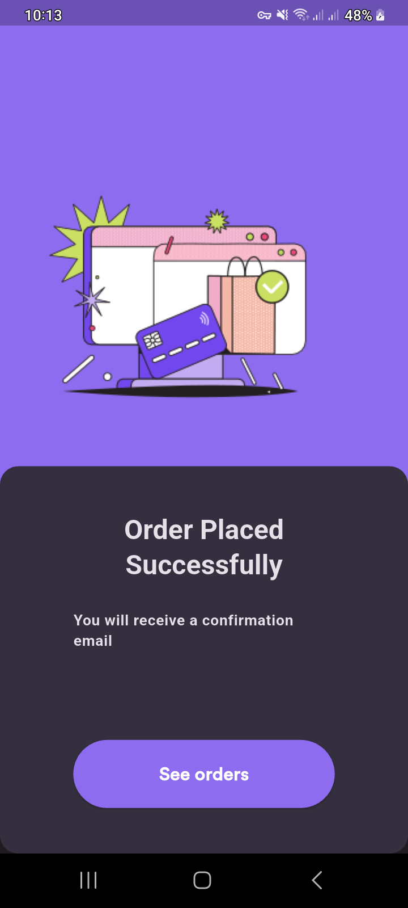
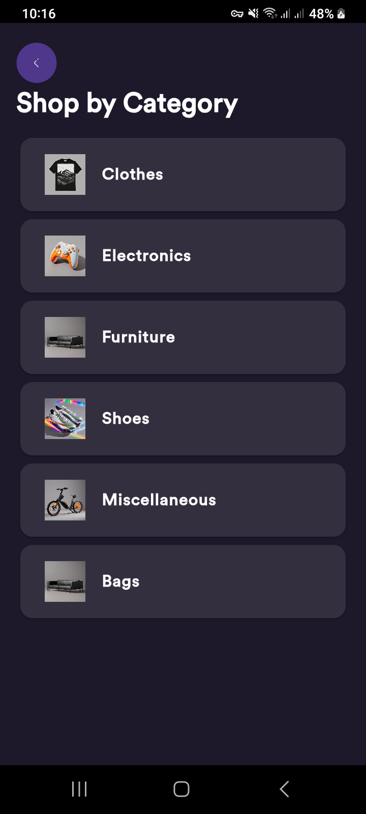
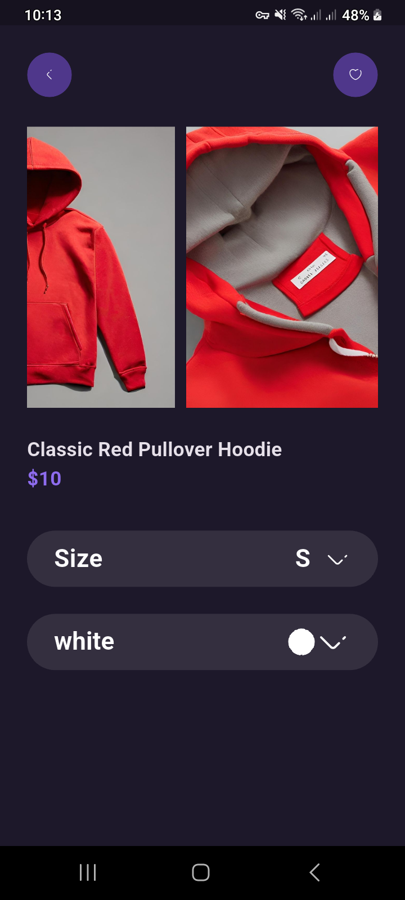
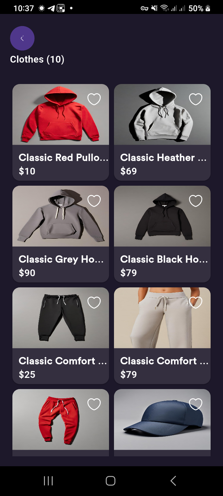

# platzy fackstore

Platzy Fack Store, A mobile Ecommerce app to present a store for multiple categories.​

The user can see the product details, add to wish list, and create a new cart.​

Finally, the user can place buy for the cart he created.​

# Features

1. Search from multiple categories, present product detiles, add to wishlist and add to cart.
2. Create Shopping cart to fill want you want to buy.
3. Change app color theme; (White and Dark).
4. Change app language; (English and Arabic). with ability to add new language.

# The packages used in this project:

`cached_network_image` - `cupertino_icons` - `dartz` - `dio` : for handling api requests - `easy_localization` : to handle changing app language - `flutter_bloc` : for state management - `flutter_dotenv` - `flutter_env_native` - `flutter_gen` : Used to orginize files - `flutter_screenutil` - `flutter_svg` - `freezed` - `get_it` : to provide dependince injection service - `go_router` - `iconsax` - `iconsax_plus` - `pretty_dio_logger` - `shared_preferences` - `shared_preferences_helper` - `theme_tailor_annotation` : Used to help in theme management

# Preview

The following previews shows how to login in to the app:

  
  

  
  

  
  

The following shows the home page:

  

The following shows the products, catigories, ordering and placing orders.

  
  

  
  

  
  

  

